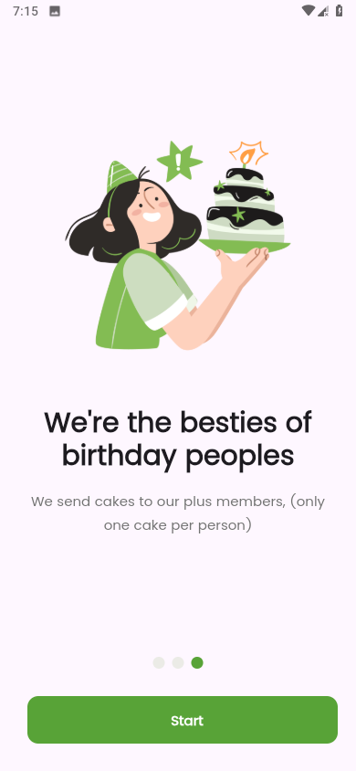
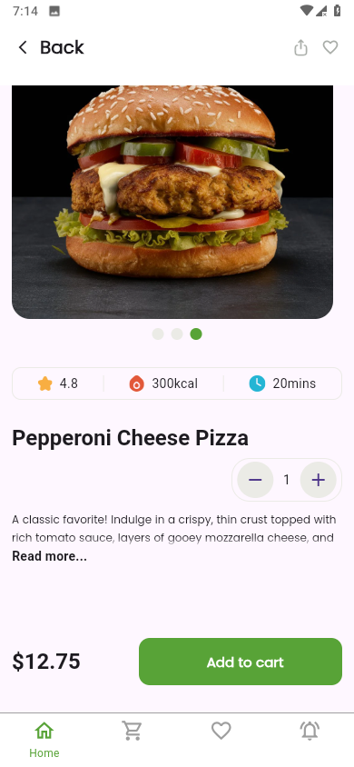
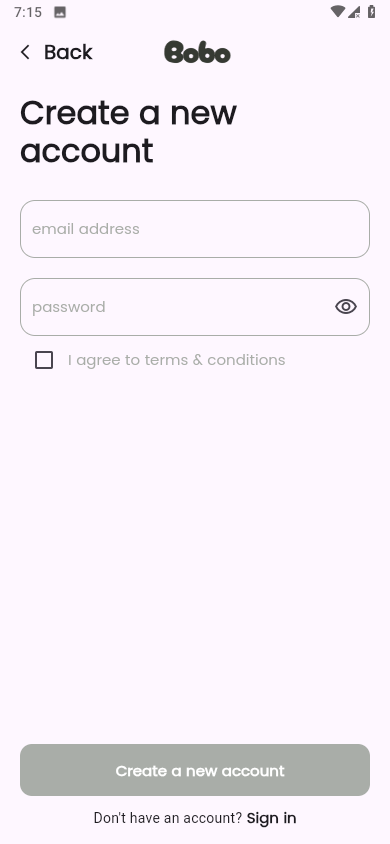
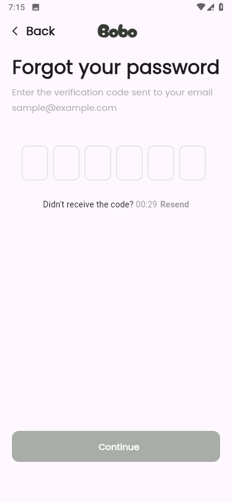
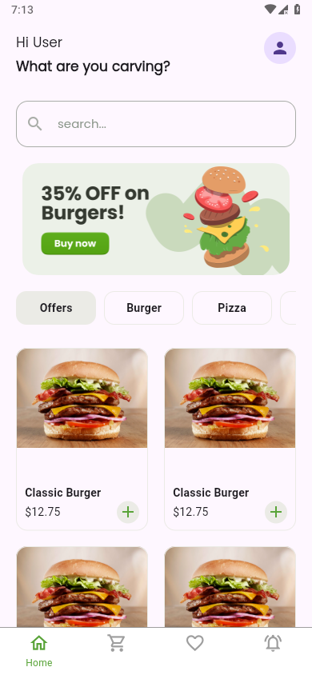
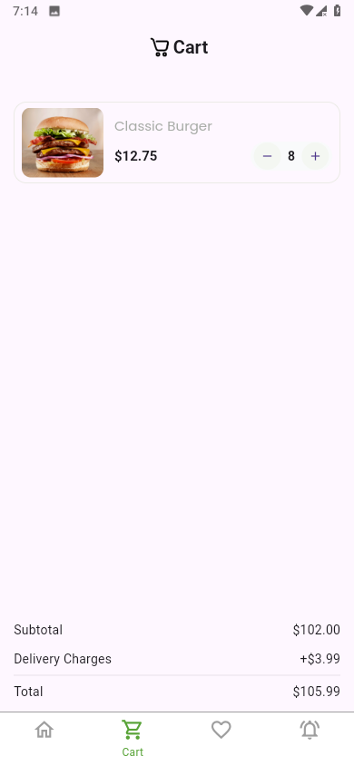

# Food Delivery App

A modern, clean, and fast Flutter mobile application for browsing food products, managing the shopping cart, and authenticating users. Built using a feature-based architecture and powered by Supabase.

---

## Features

- User authentication (Login, Sign Up, Forgot Password)
- Category and product listing
- Add to cart and quantity update
- Clean architecture and reusable components
- Supabase integration

---

## Screenshots

  
  
  
  
  
  
  
  

---

## Project Structure

