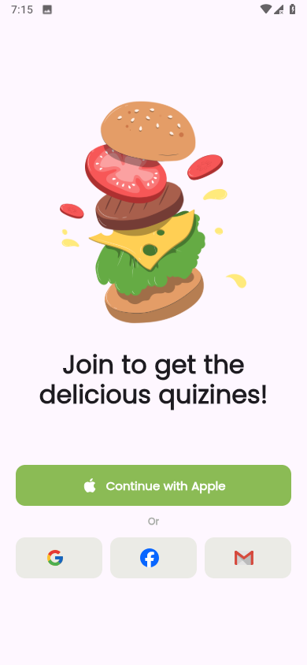

# Food Delivery App

A modern and clean Flutter mobile application for browsing food products, managing a shopping cart, and handling user authentication. The app follows a feature-based structure with clean architecture principles and integrates with Supabase as a backend.

## Features

- User authentication (Login, Sign Up, Forgot Password)
- Product listing with multiple images
- Add/remove products from the cart
- Quantity selector for each product
- Organized UI using custom components
- Responsive design

## Screenshots

### Home Screen  

### Cart Screen  

### Login Screen  

### Sign Up Screen  

### Forgot Password Screen  

## Project Structure

